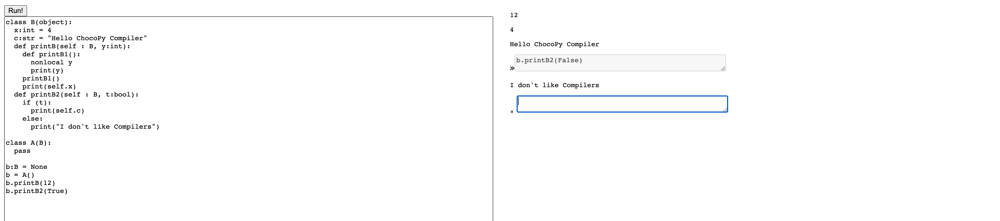

# ChocoPy Compiler

This is a [ChocoPy](https://chocopy.org/) to [WASM](https://webassembly.org/) compiler written by typescript. Basically all the grammers and function are supported in ChocoPy including

- Basic Types: number (i32 only), boolean, none, string, lists
- Basic Statements: while / for loops, if / elif branches
- Function Definitions: with nested function & nonlocal supported
- Class Definition: with inheritance supported

The compiler is also with a REPL environment allows interaction as follow



How to run:

Install node modules and make package (run only once)

```bash
npm install
make
```

build webpage and run compiler

```bash
npm run build-web
cd build
python -m SimpleHTTPServer
```

Run your ChocoPy codes at ```localhost:8000```

To test the codes simply run

```bash
npm test
```

Plz read ```developer.md``` before uploading codes