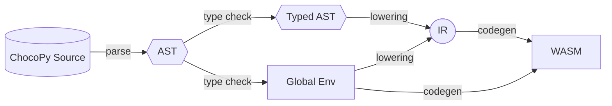
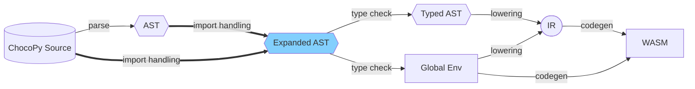

# Built-in Libraries Design

## Overview
We will implement a series of standard libraries and built-in functions for ChocoPy. We want to add a preliminary support for `float()` and `...` (Ellipsis), which includes initialization and value representation. 
We'd also like to extend `print()` to allow arbitrary length arguments, and `int() / bool()` for type conversions.

Moreover, we plan to support a simplified version of Python's `import` statements through AST transformations and some compiler refactoring (detailed below); then we plan to implement some of the built-in libraries & functions in ChocoPy itself, utilizing the function / class definitions already in the compiler, plus the `import`  statement support. This design gives us the opportunity of self-hosting some of the built-in library, and at the same time still allows us to write some part of it in TypeScript or WASM.

## Changes to the Compiler
These are the potential changes to the compiler that we plan to make in the coming week to support the first iteration of built-in libraries.

#### Compilation Pipeline

The current compiler can be roughly divided into 4 stages:
1. Parsing (py -> ast)
2. Type Checking (ast -> typed ast)
3. Lowering (typed ast -> IR)
4. Codegen (IR -> WASM)
and the compilation process follows the diagram below.


To implement our built-in library and simple `import` support, we propose to change the compiler to behave like the following new diagram, adding an **Import Handling** stage to perform code rewrite, AST transformation / re-parsing. 

We will need to change the `run()` function in `runner.ts` and the `compile()` function in `compiler.ts`, but our updated compiler should be a drop-in replacement of the original one, and shouldn't affect any other team.

#### Import Handling
We plan to place the import handling stage right after parsing before doing the type checking. We will use the information in AST, such as `imports` and function calls, to preprocess the input source code. For example, if we get the following source in its AST format, we will be able to recognize the import statement and the corresponding function calls depending on that import:

```python
from math import gcd, lcm
print(gcd(12, 16), lcm(12, 16))
```

Then we rewrite the AST to include our library implementation, essentially replacing the original source file with the updated one below:

```diff
-from math import gcd, lcm
+def gcd(a: int, b: int) -> int:
+    if(b==0):
+        return a
+    else:
+        return gcd(b,a%b)

+def lcm(x: int, y: int) -> int:
+   return (x*y)//gcd(x,y)
+
print(gcd(12, 16), lcm(12, 16))
```

After that the compilation procedure would continue as if the new AST were the original program. 

The built-in library will live inside `stdlib/*.py` or `stdlib/*.wat` and will be copied to `build/stdlib/*` so the frontend can fetch the files. We do the AST updates using Python files fetched through HTTP GET at compile time, importing `math` module would mean a request to `/stdlib/math.py`. 

In our first iteration, we'll focus on getting the basic import functionality work, meaning:
- no circular imports allowed (catching this will be kind of annoying, so we won't implement it yet)
- during AST construction, add `FunDef`s corresponding to all ImportedModules' functions to `Program.funs`; this will make type-checking seamless
- add individual functions imported from modules into the AST the same way
- for built-in functions available globally without imports, e.g. `len, max` we inject the function implementation when we see the corresponding call to it

#### AST
- add a new `ImportedModule` type:
```typescript
export type ImportedModule = {
    name: string,
    importedAs: string
}
```
- add a new field `imports: Array<ImportedModule>` to `Program`
- add new Statement type called `import`, will be eliminated by Import Handling pass before lowering to IR
- add new Literal kind `...` (but don't add its type (?), because casting to an ellipsis doesn't make sense)
- add new Literal kind `float: number`

#### IR
- we won't make changes to IR, at least not in the next few weeks.

#### Built-in libraries

- print() will get changed pretty extensively
    - print will no longer be unary -- any arity is valid!
        - nullary: prints new line
        - unary: prints the argument
        - n-ary: prints all arguments, separated by spaces

## New functions, types, and/or files
- `stdlib/math.py`
    - factorial(n : int) -> int
    - gcd(a : int, b : int) -> int
    - lcm(a : int, b : int) -> int
- `float`, as a type
- various flavors of `import` statement
    - `import x`
    - `import x as y`
    - `from x import y`

## Value representation / memory layout for new stuff
- Imported modules and functions get added to the AST during preprocessing (either through AST transformation or re-parsing)
    - NOTE that this is NOT import's full Python functionality! Files are NOT run before importing them, and we aren't adding support for importing user-made files.
- floats will be represented as [32-bit wasm floats](https://webassembly.github.io/spec/core/syntax/values.html#syntax-float)

## Functionality we'll implement next week
#### 1. Type-casting for int, bool, NoneType 

```python
>>> print(bool(3))
True
>>> print(int(3))
3
>>> print(int(False))
0
>>> print(bool(int(True))
True
```

#### 2. the `import` keyword, and module.item syntax
```python
>>> import math
>>> math : bool = False
NameError: math is already the name of an imported module
```

#### 3. `from x import y` statements (including `from x import *`)

```python
>>> from math import *
>>> def factorial():
...   return
NameError: factorial is already the name of a function
```

#### 4. `import x as y` statements

```python
>>> import math as m
>>> math : int = 30
>>> # no error!
```

#### 5. `math.factorial()`

```python
>>> from math import factorial
>>> print(factorial(5))
120
>>> print(factorial(0))
1
```

#### 6. `math.gcd()`

```python
from math import gcd
>>> print(gcd(6, 9))
3
```

#### 7. `math.lcm()`

```python
>>> from math import lcm
>>> print(lcm(6,9))
18
```

#### 8. a few extensions to print()
```python
>>> print()

>>> print(1, 1)
1 1
>>> print(print)
<built-in function print>
```

#### 9. Basic `float` Type

```python
>>> x : float = 3.2
>>> # implement floats! (but not float funcs yet)
```

#### 10. Basic Ellipse type

```python
>>> print(...)
Ellipsis  # this is an object :)
```

---

# Update 5/23
Here are the features we would like to add at this point in order to have "reasonable" functionality:
- finish up merging our several branches to get arithmetic operations on floats working
- type-casting to and from strings, including float('inf') and float('nan')
- a few more mathlib functions, like `ceil`/`floor`, `isinf`/`isnan`, and maybe some of the constants
- sum() and prod() would be very nice, but might not be doable in time

And here is a comprehensive test program for the above:
```
import math

f : float = 0.0
e : float = math.e
res : [float] = []
s : str = ""

while f < 100:
  res.append(math.floor(f))
  s = s + str(math.ceil(f)) + "-"
  f = math.pow(e,f)

print(s, sum(res))
```
This should result in a printed output of `0-1-3-16- 18`, with `res` equal to `[0,1,2,15]`.


