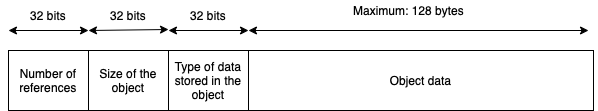

# Memory management

## Tests
### 1. Classes inherited from `object`

**Case:**
```
class Rat(object):
    y: int = 0
    def __init__(self: Rat):
		self.y = 1

x: Rat = None
x = Rat()
```
**Expected:**
Let `o` be the object referred to by variable `x`
```
assert number of references of o is 1
assert size of o(in bytes) is 4
assert type of the fields in o is [value]
```

### 2. Multiple references

**Case:**
```
class Rat(object):
    y: int = 0
    def __init__(self: Rat):
        self.y = 1
x: Rat = None
y: Rat = None
z: Rat = None
x = Rat()
y = x
z = y
```
**Expected:**
Let `o` be the object referred to by variable `x`
```
assert number of references of o is 3
assert size of o(in bytes) is 4
assert type of the fields in o is [value]
```

### 3. Removing references

**Case:**
```
class Rat(object):
    y: int = 0
    def __init__(self: Rat):
        self.y = 1
x: Rat = None
y: Rat = None
x = Rat()
y = x
y = None
```
**Expected:**
Let `o` be the object referred to by variable `x`
```
assert number of references of o is 1
assert size of o(in bytes) is 4
assert type of the fields in o is [value]
```

### 4. Removing references out of scope

**Case:**
```
class Rat(object):
    y: int = 0
    def __init__(self: Rat):
        self.y = 1
def someFunc(z: Rat):
    r: Rat = z
    r.y = 100

x: Rat = None
y: Rat = None
x = Rat()
someFunc(x)
```
**Expected:**
Let `o` be the object referred to by variable `x`
```
assert number of references of o is 1
assert size of o(in bytes) is 4
assert type of the fields in o is [value]
```

### 5. Objects created in non local scope

**Case:**
```
class Rat(object):
    y: int = 0
    def __init__(self: Rat):
        self.y = 1

def someFunc() -> Rat:
    r: Rat = None
    r = Rat()
    r.y = 100
    return r

x: Rat = None
x = someFunc()
```
**Expected:**
Let `o` be the object referred to by variable `x`
```
assert number of references of o is 1
assert size of o(in bytes) is 4
assert type of the fields in o is [value]
```

### 6. Access is not assignment

**Case:**
```
class Rat(object):
    y: int = 0
    def __init__(self: Rat):
		self.y = 1

x: Rat = None
x = Rat()
x.y
print(x.y)
```
**Expected:**
Let `o` be the object referred to by variable `x`
```
assert number of references of o is 1
assert size of o(in bytes) is 4
assert type of the fields in o is [value]
```

### 7: Objects as fields

**Case:**
```
class Link(object):
    val: int = 0
    next: Link = None
    def add(l: Link) -> Link:
        m: Link = None
        m = Link()
        l.next = m
        return m

x: Link = None
y: Link = None
y = x.add()
```
**Expected:**

Let `o` be the object referred to by variable `x` <br>
Let `p` be the object referred to by variable `y`
```
assert number of references of o is 1
assert type of feilds in o is [value, pointer]
assert number of references of p is 2
assert type of feilds in p is [value, pointer]
```

### 8. Anonymous object deletion

**Case:**
```
class Link(object):
    val: int = 0
    next: Link = None
    def add(l: Link) -> Link:
        l.next = Link()
        return l.next

x: Link = None
x.add()
x = None
```
**Expected:**
```
assert number of references of any object is 0
```

### 9. Simple linked cycle
**Case:**
```
class Link(object):
    val: int = 0
    next: Link = None

x: Link = None
y: Link = None
x = Link()
y = Link()
x.next = y
y.next = x
```
**Expected:**

Let `o` be the object referred to by variable `x` <br>
Let `p` be the object referred to by variable `y`
```
assert number of references of o is 1
assert type of feilds in o is [value, pointer]
assert number of references of p is 1
assert type of feilds in p is [value, pointer]
```

### 10. Simple deletion in cycle
**Case:**
```
class Link(object):
    val: int = 0
    next: Link = None

x: Link = None
y: Link = None
x = Link()
y = Link()
x.next = y
y.next = x

x = None
```
**Expected:**

Let `o` be the object referred to by variable `x` <br>
Let `p` be the object referred to by variable `y`
```
assert number of references of o is 0
assert type of feilds in o is [value, pointer]
assert number of references of p is 1
assert type of feilds in p is [value, pointer]
```

## Changes to IR

- ### Addition of `ref` value
```
export type Value<A> =
...
| { a?: A, tag: "ref"}
```
Currently there is no way of differentiating between pointers and values stored in an object. As seen in test case *8: Anonymous object deletion*, we need to follow references stored in an object recursively so that we can update their respective reference counts. This is not possible without knowing which field represents a reference/pointer.

- ### Addition of `allocref` expression
```
export type Expr<A> =
  ...
  | {  a?: A, tag: "allocref", types: [Value<A>] }
```
We need this expression to be called right before all the alloc calls for the fields of the object are made. To follow references and to deallocate memory on the heap, we need the size and the type information of an object which is stored on it. This expression, allows the memory manager to understand how many bytes are to be allocated/ deleted when the object is garbage collected and what will be the type of data in a field.

- ### Remove BigInt type
We feel that the implementation of `bigint` type would probably be as a contiguous array of `int` and could just be made into an `object` type. This relates to our implementation since we would not not have to account for a special case.

## Added functions
- 

## Value representation and memory layout



The type of a field is denoted by a single bit. For the memory manager we feel that it does not really matter what the type of an field is, as long as we are able to differentiate between data and references to data. The current representation that we plan uses 32 bits to represent types in an object, which puts an upper bound on the number of fields in an object to 32. If needed this number can be easily increased, assigning more bits to storing types in the metadata.

The size of the object is stored in bytes, and the number of references is stored along with the object.

### Compaction/ Defragmentation
Performing defragmentation for the heap will move objects around in the heap. Since, we can't go about modifying all the references, each object we create will have an **immutable reference number**. We plan to maintain a mapping from this reference number to the actual location in memory. When compaction takes place we will update this mapping. All variables in the program will store the **reference number** instead of the actual address in memory.

